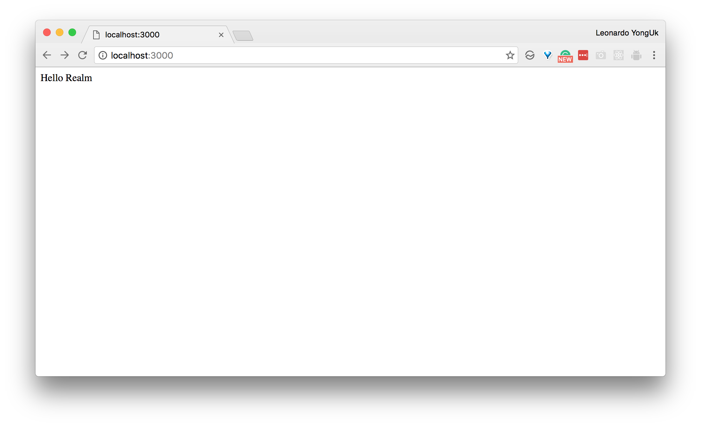
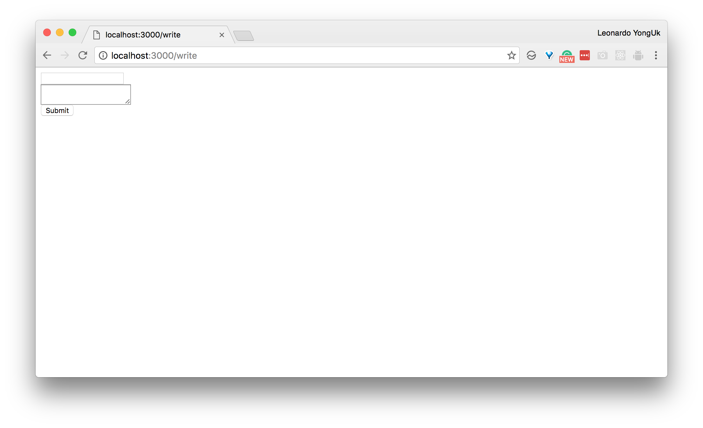
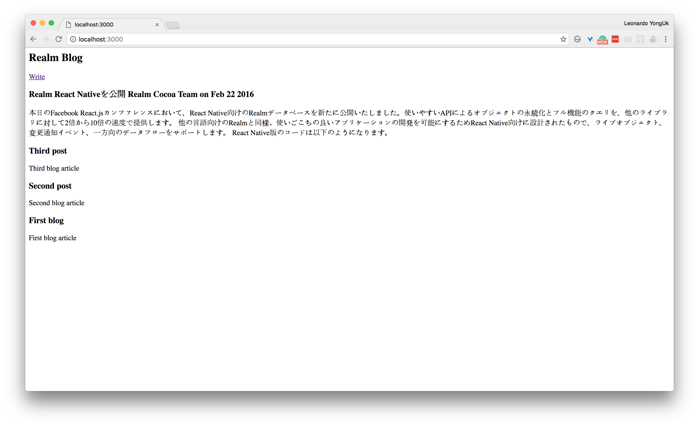

#Realm Node.jsとExpressでブログを作成

投稿者：Leonardo YongUk Kim <lk@realm.io>

翻訳者: Makoto Yamazaki <my@realm.io>

11月16日に[Realm Node.js版がリリース](https://realm.io/jp/news/first-object-database-realm-node-js-server/)されました。Realmの強力な機能をサーバーサイドで使用できるようになります。Node.jsでRealmを活用する方法を示すために、簡単なブログを作成してみましょう。

このチュートリアルでは、コマンドラインはOS XやLinuxを前提としています。また、Node.jsと`npm`がインストールされている必要があるので、インストールされていない場合、[Node.jsサイト](https://nodejs.org/ja/)を参照してインストールしてください。

##セットアップ

`realm-blog`というディレクトリで作業します。

```
mkdir realm-blog
cd realm-blog
```

まず、Node.jsプロジェクトを初期化するために、 `npm init`コマンドを実行します。

```
npm init
```

コマンドを実行すると以下のようにいくつかの項目の入力を求められます。`version`は`0.1.0`に変え、`description`をRealm Blogとしています。その他の項目は、デフォルト値に設定しました。

```
name: (realm-blog)
version: (1.0.0) 0.1.0
description: Realm Blog
entry point: (index.js)
test command:
git repository:
keywords:
author:
license: (ISC)
```

Webのリクエストを処理するためにExpress、データベースにRealm Node.js、テンプレート処理のためにEmbedded JavaScript(EJS)、フォームから渡されたクエリを処理するためにbody-parserを使用します。

```
npm install --save express
npm install --save realm
npm install --save ejs
npm install --save body-parser
```

以降、コードを変更するたびにサーバーが再起動されるようにするためNodemonをインストールします。

```
npm install --save-dev nodemon
```

このままの状態でNodemonを使用してサーバーを実行するには、 `./node_modules/nodemon/bin/nodemon.js index.js`とする必要があります。これは、少し煩雑なので、`package.json`の中の`"script"` プロパティを以下のように書き換えてください、

```
{
  ...
  "scripts": {
    "serve": "nodemon index.js"
  },
  ...
}
```

これで、`npm run serve`とするだけでテストサーバーを実行できます。

## Hello Realm！

まず、`/`リクエストを処理するコードを登録しましょう。`index.js`を作成し、以下のように入力してください。

```
'use strict';

var express = require('express');

var app = express();

app.get('/', function(req, res) {
  res.send("Hello Realm");
});

app.listen(3000, function() {
  console.log("Go!");
});
```

`/`アドレスに `GET`要求が来る簡単に画面にHello Realmと表示し、` 3000`番ポートを介して行わがされます。 Webブラウザで `localhost:3000`を開いてみましょう。`npm run serve`の実行をわすれないでください。



##書き込み機能の実装

それでは次にエントリを書く機能を実装してみましょう。まず、書き込みフォームを作ります。`write.html`ファイルを次のように作成します。

```
<form action="/write" method="POST">
  <input type="text" name="title" /><br />
  <textarea name="content"></textarea><br />
  <button type="submit">Submit</button>
</form>
```

`/write`アドレスに届く`GET`リクエストを処理するために、`index.js`の`app.listen`の行の前に次のコードを追加します。

```
app.get('/write', function(req, res) {
  res.sendFile(__dirname + "/write.html");
});
```

`/write`に対して、現在のディレクトリの`write.html`ファイルを出力します。

Webブラウザで `localhost:3000/write`にアクセスしてみましょう。



エントリをsubmitすると、 `/write`アドレスに`POST`リクエストがくるので、これを処理するためのコードを追加します。`index.js`にパーサーを追加します。

```
var express = require('express'),
    bodyParser = require('body-parser');

var app = express();

app.use(bodyParser.urlencoded({extended: true}));

app.post('/write', function(req, res) {
  res.send(req.body);
});
```

今 `localhost:3000/write`に接続して何かに入力してみましょう。 submitを押すとPOSTリクエストが発行され、webブラウザに次のように出力されます。

```
{"title":"nice","content":"to meet you"}
```

### Realmスキーマの作成

Realm Node.jsでスキーマを作りましょう。`index.js`をひらき、中身を以下のように書き換えます。

```
'use strict';

var express = require('express'),
  bodyParser = require('body-parser'),
  Realm = require('realm');

var app = express();
app.use(bodyParser.urlencoded({extended: true}));

let PostSchema = {
  name: 'Post',
  properties: {
    timestamp: 'date',
    title: 'string',
    content: 'string'
  }
};

var blogRealm = new Realm({
  path: 'blog.realm',
  schema: [PostSchema]
});

app.get('/', function(req, res) {
  res.send("Hello Realm");
});

app.get('/write', function(req, res) {
  res.sendFile(__dirname + "/write.html");
});

app.post('/write', function(req, res) {
  res.send(req.body);
});

app.listen(3000, function() {
  console.log("Go!");
});
```

注目すべき部分が２つあります。まず、 `PostSchema`を作成している部分です。`PostSchema`には２つの属性があり、一つは、モデルの名前である`name`属性で、値は`Post`としています。もう一つはこの`Post`モデルの各種情報を保持する`properties`属性で、その中には3つの属性` timestamp`、 `title`、` content`を宣言しています。

このように作成されたスキーマを、Realmのインスタンスを作成するときに、コンストラクタに渡します。 `path`属性は、データベースファイル名です。`schema`属性は データベースファイル中で使用するモデル定義を配列で指定します。今回は`Post`モデルのみなので`[PostSchema]`としています。複数のモデルを登録する場合には、配列に要素を追加してください。

### Realmでデータの書き込み

エントリを作成するために `/write`アドレスの` POST`ハンドラを以下のように変更しましょう。

```
app.post('/write', function(req, res) {
  let title = req.body['title'],
    content = req.body['content'],
    timestamp = new Date();
  blogRealm.write(() => {
    blogRealm.create('Post', {title: title, content: content, timestamp: timestamp});
  });
  res.sendFile(__dirname + "/write-complete.html");
});
```

Realmインスタンスに対して `write`メソッドで書き込みトランザクションを開き、`create`メソッドで実際の書き込みを行っています。書き込み後の画面のため、`write-complete.html`を、次のように作成しておきましょう。

```
<a href="/">Success!</a>
```

##作成されたエントリを表示する

それではメイン画面で、作成されたエントリを読み出して出力しましょう。

`views`ディレクトリに`index.ejs`を作成します。

```
<h2>Realm Blog</h2>

<a href="/write">Write</a>

<% for(var i=0; i<posts.length; i++) {%>
<h3><%= posts[i].title%></h3>
<p><%= posts[i].content%></p>
<% } %>
```

これは、 `posts`に渡されたブログのポストを出力するテンプレートです。

テンプレートに`posts`を渡すよう変更されたハンドラは以下の通りです。

```
app.set('view engine', 'ejs');

app.get('/', function(req, res) {
  let posts = blogRealm.objects('Post').sorted('timestamp', true);
  res.render('index.ejs', {posts: posts});
});
```

`app.set`でテンプレートエンジンとしてEmbedded Javascript(EJS)を使用することを宣言します。`Post`オブジェクトをすべて取得し、`timestampe`の値の降順に(`sorted`の二番目の引き数が`reverse`オプションです。省略すると、昇順)並べ替えます。

実行して `/write`を介してエントリを作成してみると以下のような画面が表示されます。



[最終的なコードはこちら](https://github.com/dalinaum/realm-blog)で確認することができます。
